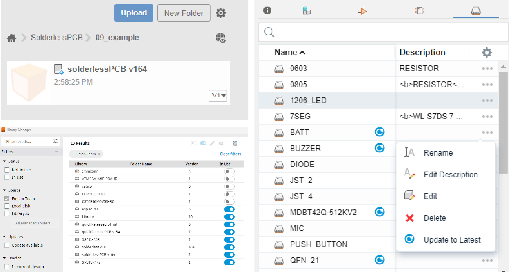

# solderlessPCB

This is an acoompanying Autodesk Fusion 360 electronic component library for SolderlessPCB project.
We aim to support component reusing during PCB prototyping through bolt-on 3D printed housing.
The housing are assembled to PCBs with pre-drilled holes. To allocate holes in the PCB design, you can use the component library during your design process.
The following is the step-by-step guideline.

## Installation

Simply create a new project in Fusion 360 and upload the **.flbr** file located at the root folder of this repository.
Update any symbol/footprint/3D model as needed, keep the local packages if given the choice.

## Design PCB

Add the component to your library manager;
Design PCB using the component from the component library;
The board will pickup footprint with bolt holes needed for each component.

## Design 3D housing

Push 2D boards to 3D;
Create a new Design, save it, and import the 3D board;
Housing can be created by extruding the profile of the board top face for desired thickness (refer to design guidlines from the paper);
Concaves for components can be created by conduting subtractive boolean operation between the main housing body created in the last step and the 3D models of each component linked from the library.

## Manufacturing and Assembly

Make your PCB using a desktop CNC or outsouce it from a vendor;
3D print your housing using an SLA 3D printer with a mixture of 40% [flexible resin](https://www.resione.com/products/f39-white-flexible-rubber-like-3d-printer-resin-1kg-1) and 60% [tough UV resin](https://store.anycubic.com/collections/uv-resin/products/uv-tough-resin?gclid=CjwKCAiAlJKuBhAdEiwAnZb7lXkZAT_TV8YlSbURp3uvyxhpXVd8JoYpCHSNXQ3PaS_QHxXaRmFo6RoC5e0QAvD_BwE) (you can use any type of resin that result in a similar shore value);
Assemble your PCB and housing together using M1.4 and M1.6 hardwares.